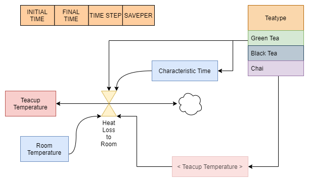

# drawio_pysd

Drawio plugin to build [PySD](https://pysd.readthedocs.io) models using [draw.io / diagrams.net](https://www.diagrams.net/).

draw.io is an open source, cross platfrom program to create charts.

This plugin makes it possible to anyone to build a SD model
using draw.io. The model can then be converted using the
python file parse_xml to load the model into PySD (as an AbstractModel), which
then translates the model to supported languages.





## Features

The following components are available

* Control Variables (start-end times, timestep and saveper)
* Constants
* Subscripts (without the subscripted initial data)
* Integ Structures
* Arithmetic Structures
* PySD functions
* Variable references

## How to use the plugin ?

You can download drawio desktop latest version here: https://get.diagrams.net/


The plugin is a simple javascript file that has to be loaded by draw.io: *Data -> Plugins... -> Add... -> Select Files...* . (If it is not possible to select a file, you will have to enable plugins. See instructions below)

The plugin creates new elements in the drawio shapes menu on the left panel.

Double clicking on a PySD elemnts opens a menu where the user can edit
the fields for the SD element (name, doc, equation, units, ... ).


Once the model is built, draw.io can export the model to a xml file.

The xml file is then read by the parse_xml.py module
which generate a PySD python model file.

```
python parse_xml.py teacup.drawio.xml
```


### Conversion from drawio to pysd


Draw.io saves by default the diagrams to a compressed xml format
which is impossible to parse.
To convert a file from the compressed to uncompressed: https://drawio-app.com/extracting-the-xml-from-mxfiles/
or:
You can to : File-> Export as.. -> XML ...
Then untick *compressed*

### Autosuggestion of variables during coding

If a pysd shape is connected to another pysd shape using an arrow,
the variable name of the target shape is automatically suggested
in the menu of the equation of the source shape.

## Plugins with drawio

plugins can be added to drawio in a quite easily fashion.
One should understand javascript and how electron works.

Example can be found at https://github.com/jgraph/drawio/tree/dev/src/main/webapp/plugins

The plugin can simply be imported in drawio.

### Enabling plugins on linux

Add the option to the command line:

`drawio --enable-plugins`

On windows, it seems to be enabled by default sometimes but not always.
You find the exectuable there:

`C:\Program Files\draw.io\draw.io.exe`

Then launch it with the option:

`drawio.exe --enable-plugins`

### Enabling plugins on the website diagrams.net

This is currently impossible for security issues
https://github.com/jgraph/drawio/issues/958#issuecomment-644206032

But one could create a custom website hosting drawio servers with
the plugin enabled.

### Location of the plugin file

Once you load the plugin for the first time on the menu, it will be loaded to:

On linux if you installed with snap:

~/snap/drawio/current/.config/draw.io/plugins

If installed with apt:

~/.config/draw.io/plugins/pysd.js

Then you can modify the plugin file directly there so you don't need to load it every time.

On windows:

C:\Users\ *username* \AppData\Roaming\draw.io\plugins

## For developers

If you want to develop this plugins, please contact us before via github issues.

Draw.io source code can be found at: https://github.com/jgraph/drawio
This is useful to understand how drawio works if one wants to modify something.

### Convenience tips

Create a symbolic link to the plugin file in the drawio plugin folder, so you don't need to load it every time.

### Detailed How it works

Draw.io has *Data* parameters that can be assigned to each shape.
The elements for pysd have special data fields that contain the relevant
pysd information.
One can easily modify the fields are available by right clicking on the shape and
selecting *Edit Data*, but this might create issues for the parser if one changes some fields.

### Improvements possible

* autosuggest units using a dropdown
* making the window with the parameters draggable/movable
* make a pysd menu to the right sidebar for the elements
* Remaining pysd elements
